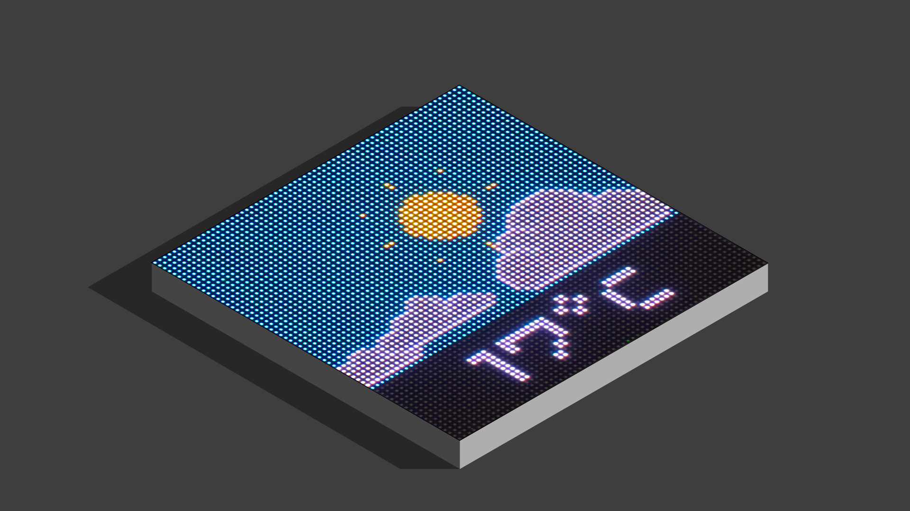

Maker Media GmbH

***

# LED-Matrizes mit MicroPython steuern, Teil 2

### Ein Infotext oder eine Laufschrift auf einer LED-Matrix sind nicht nur praktisch, sondern machen auch optisch was her. Mit ein paar animierten Grafiken lässt sich das Ganze aber auch noch ordentlich aufpeppen.

Ergänzend zum Artikel in der Make 4/24 findet ihr hier die MicroPython-Programme und die Grafiken als Download.

Den vollständigen Artikel kann man in der **[Make-Ausgabe 4/24](https://www.heise.de/select/make)** lesen.
